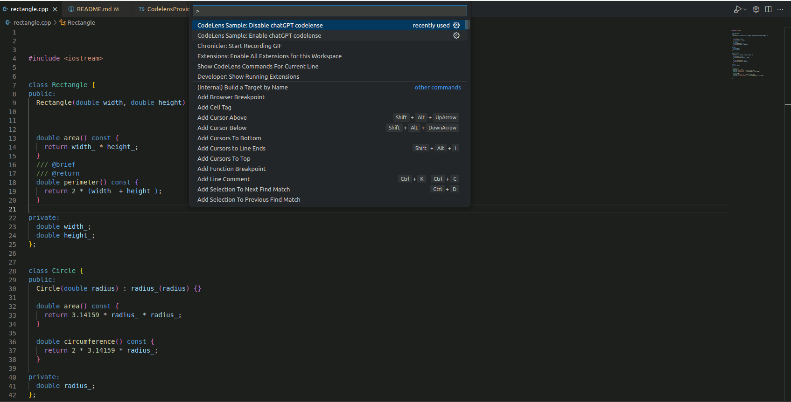

# CodeLens Docu

This is based on the a sample extension that shows the usage of the CodeLens API.

It is not intended as a production quality extension.

- Create a new file or open an existing file
- Write anything, currently the codelense gets put above "import..."->payload is the code that comes after "import" and "class..."-> payload is the class
- Click on the CodeLens for action example
- Can be enabled or disabled by command palette

## Demo

## VS Code API

### `languages` module

- [`languages.registerCodeLensProvider`](https://code.visualstudio.com/api/references/vscode-api#languages.registerCodeLensProvider)

### CodeLens Provider

- [`CodeLensProvider`](https://code.visualstudio.com/api/references/vscode-api#CodeLensProvider)
- [`CodeLensProvider.provideCodeLenses`](https://code.visualstudio.com/api/references/vscode-api#CodeLensProvider.provideCodeLenses)
- [`CodeLensProvider.resolveCodeLens`](https://code.visualstudio.com/api/references/vscode-api#CodeLensProvider.resolveCodeLens)

## Debugging/Running the Sample via source:

- Run `npm install` in terminal to install dependencies
- set chat-GPT key via https://help.openai.com/en/articles/5112595-best-practices-for-api-key-safety
- Run the `Run Extension` target in the Debug View. This will:
	- Start a task `npm: watch` to compile the code
	- Run the extension in a new VS Code window

## Where to start if I want to edit the output and functionality: 
- Edit the documentation output via the function `generateSummary` in `./src/CodelenseProvider.ts` 
- Edit the regex or the openAI API request to change the captured code or the manipulation chatgpt is doing
- Test via the debugging steps above

## To build the CodeLens sample and activate it in VS Code, you can follow these general steps:

Install the VSCE tool by running the command "npm install -g vsce" in your terminal.

Navigate to the root directory of your extension.
Run the command "vsce package" to create a VSIX file of your extension.

The VSIX file will be generated and saved to the root

In the Extensions view, click on the "..." menu icon (⠇) next to your extension folder and select "Install from VSIX...".

Enable the plugin in the command palette

